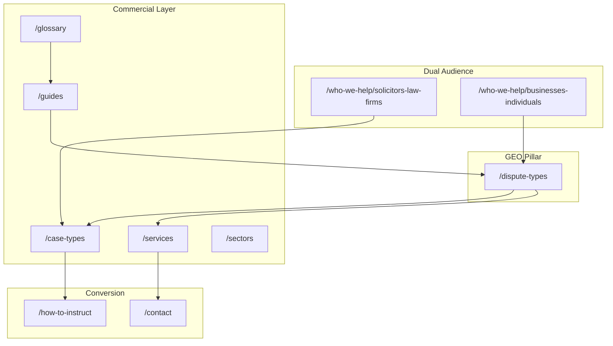
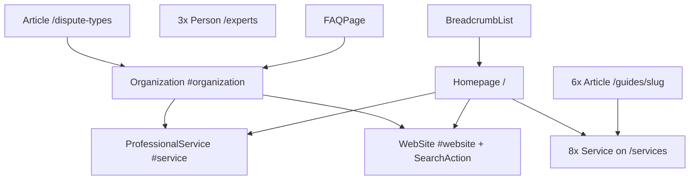

# SEO Architecture — disputeaccounting.com

**Site:** https://www.disputeaccounting.com  
**Audience:** UK solicitors and law firms (expert witness / litigation support) **and** UK businesses and individuals (pre-litigation dispute accounting)  
**Primary KPI:** Rank for Tier 1 transactional terms (e.g. *dispute accounting*, *dispute accounting expert witness UK*, *dispute accountant UK*)  
**Last updated:** May 2026

This document is the canonical SEO blueprint for DisputeAccounting.com. It governs keyword targeting, content clusters, internal linking, structured data, GEO (generative engine optimization), off-page activity, competitor monitoring, dual-audience conversion architecture, and deployment.

**Unique differentiator:** This is the only site in the expert-witness network with a **dual-audience architecture** (`/who-we-help/solicitors-law-firms` vs `/who-we-help/businesses-individuals`). See [Section 8](#8-unique-strategic-note-dual-audience-architecture).

---

## Table of contents

1. [Keyword strategy](#1-keyword-strategy)
2. [Content cluster map](#2-content-cluster-map)
3. [Internal linking rules](#3-internal-linking-rules)
4. [Schema architecture](#4-schema-architecture)
5. [GEO optimization targets](#5-geo-optimization-targets)
6. [Off-page SEO targets](#6-off-page-seo-targets)
7. [Competitor monitoring](#7-competitor-monitoring)
8. [Unique strategic note: dual-audience architecture](#8-unique-strategic-note-dual-audience-architecture)
9. [Deployment checklist](#9-deployment-checklist)
- [Sitemap & robots generation](#sitemap--robots-generation)
- [Appendix A: Full route inventory](#appendix-a-full-route-inventory)
- [Appendix B: Sitemap priorities](#appendix-b-sitemap-priorities)
- [Appendix C: Title and meta templates](#appendix-c-title-and-meta-templates)
- [Appendix D: Implementation status](#appendix-d-implementation-status)

---

## 1. Keyword strategy

### Tier 1 — Transactional

| Keyword |
|---------|
| dispute accounting |
| dispute accounting UK |
| dispute accounting expert |
| dispute accounting expert witness UK |
| forensic accountant disputes UK |
| accounting disputes expert UK |
| dispute accounting services UK |
| forensic accounting dispute resolution |
| accounting expert witness disputes |
| dispute accountant UK |

### Tier 2 — Informational

| Keyword |
|---------|
| what is dispute accounting |
| difference between dispute accounting and forensic accounting |
| when do you need a dispute accountant |
| what does a forensic accountant do in disputes |
| dispute accounting vs forensic accounting UK |
| how to instruct dispute accountant UK |
| dispute accounting expert witness fees |
| CPR Part 35 forensic accountant |
| shadow expert accounting disputes UK |
| expert determination accounting UK |

### Tier 3 — Long-tail / case type

| Keyword |
|---------|
| shareholder dispute accounting expert UK |
| fraud investigation accounting expert |
| M&A dispute accounting expert witness |
| matrimonial dispute accounting UK |
| insolvency accounting expert witness |
| professional negligence accounting expert |
| HMRC tax dispute accountant expert |
| insurance BI dispute accounting expert |
| construction dispute accounting UK |
| financial services dispute accountant |

### Keyword → URL mapping

| Keyword cluster | Primary URL | Secondary URLs |
|-----------------|-------------|----------------|
| dispute accounting (UK) | `/` | `/what-is-dispute-accounting`, `/services` |
| expert witness (solicitor intent) | `/who-we-help/solicitors-law-firms` | `/qualifications`, `/how-to-instruct`, `/guides/instructing-dispute-accountant` |
| forensic accountant for my dispute (business) | `/who-we-help/businesses-individuals` | `/what-is-dispute-accounting`, `/dispute-types` |
| dispute accounting vs forensic accounting | `/what-is-dispute-accounting` | `/faq`, `/guides/what-forensic-accountants-do-disputes` |
| what is dispute accounting / when needed | `/what-is-dispute-accounting` | `/dispute-types`, `/faq` |
| types of accounting disputes | `/dispute-types` | All `/case-types/[slug]`, `/glossary` |
| loss quantification / but-for | `/services#loss-quantification` | `/guides/loss-quantification-guide`, `/case-types/commercial-contract-disputes` |
| Hadley / wasted expenditure | `/case-types/commercial-contract-disputes` | `/guides/loss-quantification-guide`, `/glossary#hadley-v-baxendale`, `/glossary#wasted-expenditure` |
| shareholder dispute accounting | `/case-types/shareholder-disputes` | `/guides/shareholder-dispute-accounting-guide`, `/services#shareholder-partnership-disputes` |
| fraud / POCA / asset tracing | `/case-types/fraud-financial-crime` | `/guides/fraud-investigation-civil-recovery`, `/services#fraud-investigation`, `/services#asset-tracing` |
| M&A / completion accounts / earn-out | `/case-types/ma-transaction-disputes` | `/guides/ma-dispute-accounting-guide`, `/services#ma-transaction-disputes` |
| matrimonial / hidden income | `/case-types/matrimonial-financial-disputes` | `/services#matrimonial-financial`, `/qualifications` (FPR Part 25) |
| insolvency / wrongful trading | `/case-types/insolvency-administration` | `/dispute-types` (insolvency section) |
| professional negligence / SAAMCo | `/case-types/professional-negligence` | `/glossary#saamco-principle`, `/glossary#allied-maples-principle` |
| tax / HMRC valuation | `/case-types/tax-disputes-hmrc` | `/sectors/financial-services` |
| insurance BI / loss of profit | `/case-types/insurance-business-interruption` | `/services#loss-quantification` |
| CPR Part 35 / shadow expert / SJE | `/qualifications`, `/faq` | `/glossary#cpr-part-35`, `/glossary#shadow-expert`, `/how-to-instruct` |
| instruct / fees | `/how-to-instruct`, `/fees` | `/guides/instructing-dispute-accountant` |
| sector long-tail | `/sectors/[slug]` | Matching `/case-types/[slug]` where applicable |
| construction dispute accounting | `/sectors/construction-engineering` | `/case-types/commercial-contract-disputes`, `/glossary#emden-formula` |
| financial services dispute accountant | `/sectors/financial-services` | `/case-types/shareholder-disputes`, `/glossary#isda-master-agreement` |

---

## 2. Content cluster map

Eight topical hubs anchor the site. The GEO pillar page `/dispute-types` sits at the centre of dispute-type and methodology clusters.

### URL canonicalization policy

All internal links, sitemap entries, schema `@id` values, and JSON-LD must use **canonical slugs** below. Shorthand paths from early SEO briefs are **aliases only** — do not create duplicate routes.

| Alias (do not use as route) | Canonical path |
|-----------------------------|----------------|
| `/who-we-help/solicitors` | `/who-we-help/solicitors-law-firms` |
| `/who-we-help/businesses` | `/who-we-help/businesses-individuals` |
| `/guides/shareholder-dispute-accounting` | `/guides/shareholder-dispute-accounting-guide` |
| `/guides/what-forensic-accountants-do` | `/guides/what-forensic-accountants-do-disputes` |
| `/case-types/matrimonial-financial` | `/case-types/matrimonial-financial-disputes` |
| `/case-types/ma-transaction` | `/case-types/ma-transaction-disputes` |
| `/case-types/insurance-bi` | `/case-types/insurance-business-interruption` |
| `/services#shareholder-partnership` | `/services#shareholder-partnership-disputes` |

### Hub overview

| Hub | Pillar / anchor | Primary intent |
|-----|-----------------|----------------|
| 1 | Commercial Contract Disputes | Loss quantification, but-for, Hadley, wasted expenditure |
| 2 | Shareholder Disputes | S994, share valuation, financial investigation |
| 3 | Fraud Investigation | Civil fraud, POCA, asset tracing, freezing orders |
| 4 | M&A Disputes | Completion accounts, earn-out, locked box |
| 5 | Who We Help | Dual audience conversion (solicitors vs businesses) |
| 6 | Dispute Types (Master) | Pillar taxonomy of all accounting disputes |
| 7 | Matrimonial Disputes | FPR Part 25, business valuation, hidden income |
| 8 | Expert Witness Role | CPR Part 35, shadow expert, Ikarian Reefer |

### Hub 1: Commercial Contract Disputes

**Supporting pages:**

- `/case-types/commercial-contract-disputes`
- `/guides/loss-quantification-guide`
- `/services#loss-quantification`
- `/dispute-types` (contract section)
- `/glossary#but-for-analysis`
- `/glossary#hadley-v-baxendale`
- `/glossary#wasted-expenditure`

### Hub 2: Shareholder Disputes

**Supporting pages:**

- `/case-types/shareholder-disputes`
- `/guides/shareholder-dispute-accounting-guide`
- `/services#shareholder-partnership-disputes`
- `/dispute-types` (shareholder section)
- `/glossary#s994-petition`
- `/sectors/financial-services`

### Hub 3: Fraud Investigation

**Supporting pages:**

- `/case-types/fraud-financial-crime`
- `/guides/fraud-investigation-civil-recovery`
- `/services#fraud-investigation`
- `/services#asset-tracing`
- `/dispute-types` (fraud section)
- `/glossary#poca`
- `/glossary#norwich-pharmacal`
- `/glossary#frozen-asset-order`

### Hub 4: M&A Disputes

**Supporting pages:**

- `/case-types/ma-transaction-disputes`
- `/guides/ma-dispute-accounting-guide`
- `/services#ma-transaction-disputes`
- `/dispute-types` (M&A section)
- `/glossary#completion-accounts`
- `/glossary#earn-out`
- `/glossary#locked-box`

### Hub 5: Who We Help

**Supporting pages:**

- `/who-we-help/solicitors-law-firms`
- `/who-we-help/businesses-individuals`
- `/how-to-instruct`
- `/guides/instructing-dispute-accountant`
- `/faq` (shadow expert, pre-litigation Q&As)

### Hub 6: Dispute Types (Master)

**Supporting pages:**

- `/dispute-types` (pillar)
- All `/case-types/[slug]` pages (×10)
- `/what-is-dispute-accounting`
- `/glossary` (all terms)

### Hub 7: Matrimonial Disputes

**Supporting pages:**

- `/case-types/matrimonial-financial-disputes`
- `/services#matrimonial-financial`
- `/dispute-types` (matrimonial section)
- `/qualifications` (FPR Part 25 section)

### Hub 8: Expert Witness Role

**Supporting pages:**

- `/guides/what-forensic-accountants-do-disputes`
- `/qualifications`
- `/what-is-dispute-accounting`
- `/glossary#cpr-part-35`
- `/glossary#shadow-expert`
- `/glossary#ikarian-reefer`

### Content cluster diagram



### Slug inventories

#### Services (8 anchors on `/services`)

| Anchor ID | Label |
|-----------|-------|
| `loss-quantification` | Loss Quantification & Quantum |
| `fraud-investigation` | Fraud Investigation & Detection |
| `asset-tracing` | Asset Tracing & Recovery |
| `business-share-valuation` | Business & Share Valuation |
| `shareholder-partnership-disputes` | Shareholder & Partnership Dispute Accounting |
| `ma-transaction-disputes` | M&A Transaction Dispute Accounting |
| `matrimonial-financial` | Matrimonial Financial Dispute Accounting |
| `expert-witness-reports` | Expert Witness Reports & Testimony |

*Source: planned `src/data/services.ts`, `src/lib/schema.ts` (`serviceNode` IDs), footer service links.*

#### Case types (10)

| Slug | H1 focus |
|------|----------|
| `commercial-contract-disputes` | Commercial Contract Dispute Accounting Expert UK |
| `shareholder-disputes` | Shareholder Dispute Accounting Expert UK |
| `fraud-financial-crime` | Fraud & Financial Crime Dispute Accounting Expert UK |
| `ma-transaction-disputes` | M&A Transaction Dispute Accounting Expert UK |
| `matrimonial-financial-disputes` | Matrimonial Financial Dispute Accounting Expert UK |
| `insolvency-administration` | Insolvency & Administration Dispute Accounting Expert UK |
| `partnership-disputes` | Partnership Dispute Accounting Expert UK |
| `professional-negligence` | Professional Negligence Dispute Accounting Expert UK |
| `tax-disputes-hmrc` | Tax Dispute Accounting Expert UK \| HMRC Valuations |
| `insurance-business-interruption` | Insurance & Business Interruption Dispute Accounting Expert UK |

*Aligned with `src/data/case-types.ts`.*

#### Sectors (6)

| Slug | H1 focus |
|------|----------|
| `financial-services` | Financial Services Dispute Accounting Expert UK |
| `construction-engineering` | Construction & Engineering Dispute Accounting Expert UK |
| `technology-software` | Technology & Software Dispute Accounting Expert UK |
| `professional-practices` | Professional Practice Dispute Accounting Expert UK |
| `retail-hospitality` | Retail & Hospitality Dispute Accounting Expert UK |
| `manufacturing-supply-chain` | Manufacturing & Supply Chain Dispute Accounting Expert UK |

*Aligned with `src/data/sectors.ts` and contact form sector dropdown.*

#### Guides (6)

| Slug | `aboutServiceId` (Article schema) |
|------|-----------------------------------|
| `what-forensic-accountants-do-disputes` | `expert-witness-reports` |
| `loss-quantification-guide` | `loss-quantification` |
| `fraud-investigation-civil-recovery` | `fraud-investigation` |
| `shareholder-dispute-accounting-guide` | `shareholder-partnership-disputes` |
| `ma-dispute-accounting-guide` | `ma-transaction-disputes` |
| `instructing-dispute-accountant` | *(none — procedural guide)* |

*Aligned with `src/data/guides.ts`.*

#### Glossary (32 terms, definition-first)

| # | Term | Anchor slug |
|---|------|-------------|
| 1 | Account of Profits | `#account-of-profits` |
| 2 | Allied Maples Principle (Loss of Chance) | `#allied-maples-principle` |
| 3 | Asset Tracing | `#asset-tracing` |
| 4 | But-For Analysis | `#but-for-analysis` |
| 5 | Completion Accounts | `#completion-accounts` |
| 6 | CPR Part 35 | `#cpr-part-35` |
| 7 | Earn-Out Agreement | `#earn-out` |
| 8 | Expert Determination | `#expert-determination` |
| 9 | Forensic Accounting | `#forensic-accounting` |
| 10 | FPR Part 25 | `#fpr-part-25` |
| 11 | Frozen Asset Order (Freezing Injunction) | `#frozen-asset-order` |
| 12 | Hadley v Baxendale [1854] | `#hadley-v-baxendale` |
| 13 | Hidden Income Analysis | `#hidden-income-analysis` |
| 14 | The Ikarian Reefer Duties | `#ikarian-reefer` |
| 15 | Insolvency Act 1986 s214 (Wrongful Trading) | `#wrongful-trading-s214` |
| 16 | Insolvency Act 1986 s238 (Transaction at Undervalue) | `#transaction-at-undervalue-s238` |
| 17 | Joint Statement (Expert Witnesses) | `#joint-statement` |
| 18 | Locked Box Mechanism | `#locked-box` |
| 19 | Loss Quantification | `#loss-quantification` |
| 20 | Norwich Pharmacal Order | `#norwich-pharmacal` |
| 21 | Party-Appointed Expert (PAE) | `#party-appointed-expert` |
| 22 | Proceeds of Crime Act (POCA) | `#poca` |
| 23 | Quantum | `#quantum` |
| 24 | S994 Petition (Unfair Prejudice) | `#s994-petition` |
| 25 | SAAMCo Principle | `#saamco-principle` |
| 26 | Shadow Expert | `#shadow-expert` |
| 27 | Single Joint Expert (SJE) | `#single-joint-expert` |
| 28 | Transaction at Undervalue | `#transaction-at-undervalue` |
| 29 | Wasted Expenditure | `#wasted-expenditure` |
| 30 | Wrotham Park Damages | `#wrotham-park-damages` |
| 31 | ISDA Master Agreement | `#isda-master-agreement` |
| 32 | Emden Formula (Construction Overhead) | `#emden-formula` |

**Default glossary internal links:**

| Term | Link target |
|------|-------------|
| But-For Analysis | `/guides/loss-quantification-guide` |
| Hadley v Baxendale | `/case-types/commercial-contract-disputes` |
| Wasted Expenditure | `/guides/loss-quantification-guide` |
| S994 Petition | `/case-types/shareholder-disputes` |
| Completion Accounts | `/case-types/ma-transaction-disputes` |
| Earn-Out / Locked Box | `/case-types/ma-transaction-disputes` |
| CPR Part 35 | `/qualifications` |
| FPR Part 25 | `/qualifications` |
| POCA | `/case-types/fraud-financial-crime` |
| Norwich Pharmacal / Frozen Asset Order | `/guides/fraud-investigation-civil-recovery` |
| Shadow Expert | `/who-we-help/solicitors-law-firms` |
| SJE / PAE | `/how-to-instruct` |
| Asset Tracing | `/services#asset-tracing` |
| Wrotham Park Damages | `/case-types/commercial-contract-disputes` |
| SAAMCo / Allied Maples | `/case-types/professional-negligence` |
| Wrongful Trading / Transaction at Undervalue | `/case-types/insolvency-administration` |
| Hidden Income Analysis | `/case-types/matrimonial-financial-disputes` |
| ISDA Master Agreement | `/sectors/financial-services` |
| Emden Formula | `/sectors/construction-engineering` |
| Forensic Accounting | `/what-is-dispute-accounting` |
| Loss Quantification | `/services#loss-quantification` |

---

## 3. Internal linking rules

### Rule 1 — `/dispute-types` links to:

- All 10 `/case-types/[slug]` pages
- All 8 `/services` section anchors
- Relevant `/glossary` terms (inline + related terms block)
- `/who-we-help` (hub) and both audience child pages
- `/contact`

### Rule 2 — `/who-we-help/solicitors-law-firms` links to:

- All `/case-types/[slug]` pages
- `/how-to-instruct`
- `/qualifications`
- `/guides/instructing-dispute-accountant`
- `/contact`

### Rule 3 — `/who-we-help/businesses-individuals` links to:

- Relevant `/case-types/[slug]` pages (fraud, shareholder, M&A, matrimonial, partnership, insurance)
- `/what-is-dispute-accounting`
- `/dispute-types`
- `/contact`

### Rule 4 — Every `/case-types/[slug]` links to:

- Relevant `/services` section (hash anchor)
- Relevant `/sectors/[slug]` where applicable
- Relevant `/guides/[slug]` where applicable
- `/dispute-types` (relevant section anchor)
- `/glossary` (key terms used on page)
- `/how-to-instruct`
- `/contact`

### Rule 5 — Every `/guides/[slug]` links to:

- `/guides` (hub)
- Relevant `/case-types/[slug]`
- `/dispute-types`
- `/who-we-help` (hub and/or audience pages)
- `/how-to-instruct`
- `/contact`

### Rule 6 — Homepage links to:

- `/who-we-help/solicitors-law-firms`
- `/who-we-help/businesses-individuals`
- All 8 `/services` section anchors (via service cards)
- `/dispute-types`
- `/what-is-dispute-accounting`
- `/guides`
- `/faq`
- `/contact`

### Rule 7 — Every `/sectors/[slug]` links to:

- Relevant `/case-types/[slug]`
- Relevant `/services` section anchor
- `/dispute-types`
- `/qualifications`
- `/contact`

### Rule 8 — `/glossary` term blocks link to:

- Most relevant `/case-types/[slug]`
- Most relevant `/guides/[slug]`
- `/dispute-types` for dispute-type taxonomy terms
- `/sectors/[slug]` for sector-specific terms
- `/qualifications` for CPR Part 35 / FPR Part 25 terms

### Implementation matrix

| Page template | Required outbound links | Enforce via |
|---------------|-------------------------|-------------|
| `DisputeTypesPage` | all case-types, 8 services#, glossary, who-we-help, contact | content + `RelatedLinks` |
| `WhoWeHelpSolicitorsPage` | all case-types, instruct, qualifications, guide, contact | static sections + `RelatedLinks` |
| `WhoWeHelpBusinessPage` | relevant case-types, what-is, dispute-types, contact | static sections + `RelatedLinks` |
| `CaseTypePage` | services#, sector, guide, dispute-types#, glossary, instruct, contact | `relatedLinks` in `src/data/case-types.ts` |
| `SectorPage` | case-type, services#, dispute-types, qualifications, contact | `relatedLinks` in `src/data/sectors.ts` |
| `GuidePage` | guides hub, case-types, dispute-types, who-we-help, instruct, contact | `relatedLinks` in `src/data/guides.ts` |
| `GlossaryPage` | per-term links (table above) | `src/data/glossary.ts` |
| `HomePage` | dual audience, 8 services, dispute-types, definition, guides, faq, contact | static section components |
| `ServicesPage` | dispute-types, case-types, contact per section | section footers |

Use the `relatedLinks?: { href: string; label: string }[]` field on content types in `src/data/types.ts` and a shared `RelatedLinks` component on all templates. Merge automated hub links via `src/lib/seo-internal-links.ts` (pattern from sibling site).

### Navigation reference

**Desktop nav** (`src/components/layout/Header.tsx`): Home | Services ▾ | Dispute Types ▾ | Who We Help ▾ | Case Types ▾ | Sectors ▾ | Resources ▾ (Guides, How to Instruct, Qualifications) + CTA **Contact Us** → `/contact`. FAQ and Fees are footer-only (not in navbar).

**Mobile groups:** Services | Dispute Types (all sections) | Who We Help | Case Types | Sectors | Resources | Contact Us (full width).

**Footer columns** (`src/components/layout/Footer.tsx`):

- **Col 1 — Services:** all 8 service anchor links
- **Col 2 — Case Types:** featured case types + “View all 10 →” `/case-types`
- **Col 3 — Resources:** Guides, Glossary, FAQ, Fees, How to Instruct, What is Dispute Accounting?
- **Col 4 — Who We Help:** Solicitors & Law Firms, Businesses & Individuals, Our Experts, Qualifications, Contact

---

## 4. Schema architecture

### Root entity

**Organization**  
`@id`: `https://www.disputeaccounting.com/#organization`

Implemented in `src/lib/schema.ts` as `organizationSchema`. Published from homepage `@graph`.

### Schema hierarchy



### Children by page type

| Schema type | Pages | Helper (`src/lib/schema.ts`) | Component |
|-------------|-------|------------------------------|-----------|
| Organization | Homepage `@graph` | `organizationSchema` | `JsonLd` |
| ProfessionalService | Homepage | `professionalServiceSchema` | `JsonLd` |
| WebSite + SearchAction | Homepage | `websiteSchema` (glossary search URL) | `JsonLd` |
| Service (×8) | `/services` | `serviceNode(id, name, desc)` | `JsonLd` |
| Article (pillar) | `/dispute-types` | `articleSchema` — `about` → `#loss-quantification` | `JsonLd` |
| Article (×6) | `/guides/[slug]` | `articleSchema` + `aboutServiceId` | `JsonLd` |
| Person (×3) | `/experts` | `personSchema` | `JsonLd` |
| FAQPage | `/faq` (12 Q&As) | `faqPageSchema` | `JsonLd` |
| FAQPage | `/glossary` (32 terms) | `faqPageSchema` | `JsonLd` |
| FAQPage | `/case-types/[slug]` (×10) | `faqPageSchema` | `JsonLd` |
| FAQPage | `/sectors/[slug]` (×6) | `faqPageSchema` | `JsonLd` |
| BreadcrumbList | All non-homepage | `breadcrumbSchema` | `JsonLd` |
| Organization + BreadcrumbList | `/who-we-help/solicitors-law-firms`, `/who-we-help/businesses-individuals` | `organizationSchema` + `breadcrumbSchema` | `JsonLd` |

### Service `@id` nodes (must match `/services` anchors)

```
https://www.disputeaccounting.com/services#loss-quantification
https://www.disputeaccounting.com/services#fraud-investigation
https://www.disputeaccounting.com/services#asset-tracing
https://www.disputeaccounting.com/services#business-share-valuation
https://www.disputeaccounting.com/services#shareholder-partnership-disputes
https://www.disputeaccounting.com/services#ma-transaction-disputes
https://www.disputeaccounting.com/services#matrimonial-financial
https://www.disputeaccounting.com/services#expert-witness-reports
```

### Homepage `@graph` example

Render a single `<JsonLd>` with `@context` + `@graph` array containing:

1. `organizationSchema` — name: DisputeAccounting, email: info@disputeaccounting.com, addressCountry: GB, areaServed: United Kingdom, sameAs: LinkedIn URL
2. `professionalServiceSchema` — serviceType: Dispute Accounting, hasOfferCatalog: 8 services
3. `websiteSchema` — SearchAction targeting `/glossary?q={search_term_string}`
4. All 8 `serviceNode(...)` entries (or reference by `@id` on homepage)

### Organization snippet (reference)

```json
{
  "@type": "Organization",
  "@id": "https://www.disputeaccounting.com/#organization",
  "name": "DisputeAccounting",
  "url": "https://www.disputeaccounting.com",
  "email": "info@disputeaccounting.com",
  "address": { "@type": "PostalAddress", "addressCountry": "GB" },
  "areaServed": { "@type": "Country", "name": "United Kingdom" }
}
```

### Indexing exclusions

| Path | robots |
|------|--------|
| `/thank-you` | `noindex, nofollow` |
| `/privacy` | `noindex, follow` |
| `/terms` | `noindex, follow` |
| `/contact` | indexable; **excluded from sitemap** only |

Use `createMetadata({ noindex: true })` in `src/lib/metadata.ts`.

### Wiring checklist (dev)

- [ ] Import `JsonLd` from `src/components/JsonLd.tsx` on every page template
- [ ] Homepage: full `@graph`
- [ ] Pass `faqs` from content data into `faqPageSchema` on case-type, sector, faq, glossary pages
- [ ] Pass `aboutServiceId` into `articleSchema` for guides per Section 2 table
- [ ] Breadcrumbs: pass trail into `breadcrumbSchema` via shared `PageHero` or layout
- [ ] `/who-we-help/*`: Organization reference + BreadcrumbList

---

## 5. GEO optimization targets

AI systems and answer engines should cite structured, definition-first content. Priority assets:

### Citation assets (11)

| # | Asset | Page | Location / format |
|---|-------|------|-------------------|
| 1 | Types of accounting disputes master table | `/dispute-types` | H2: Overview of Dispute Types — columns: Dispute Type, Core Accounting Issue, Expert Role, Court/Forum |
| 2 | Dispute accounting vs forensic accounting distinction | `/what-is-dispute-accounting` | H2: Dispute Accounting vs Forensic Accounting — definition-first comparison |
| 3 | Roles of dispute accountant table | `/guides/what-forensic-accountants-do-disputes` | Table: Role (investigator, expert witness, shadow expert, SJE, expert determiner), When needed |
| 4 | Loss quantification methodology steps | `/guides/loss-quantification-guide` | Numbered steps: baseline → counterfactual → but-for comparison → heads of loss |
| 5 | Fraud investigation phased methodology | `/services#fraud-investigation` | Table: Phase \| What We Do \| Deliverable |
| 6 | M&A dispute types table | `/case-types/ma-transaction-disputes` | Completion accounts vs warranty vs earn-out vs locked box |
| 7 | Glossary (32 terms) | `/glossary` | Definition-first; one block per term; client-side search |
| 8 | BI formula application | `/case-types/insurance-business-interruption` | Standard UK BI formula with worked structure |
| 9 | Shareholder dispute accounting issues | `/guides/shareholder-dispute-accounting-guide` | Valuation vs investigation; S994 issues table |
| 10 | Instruction process timeline | `/how-to-instruct` | 7-step timeline (solicitor + business sections) |
| 11 | Dispute accounting UK key facts | `/` (homepage) | H2: Dispute Accounting UK: Key Facts — columns: Metric, Figure, Source |

### Homepage statistics table (asset 11)

| Metric | Figure | Source |
|--------|--------|--------|
| Typical hourly rate | £150–£500/hr | Industry average |
| Court framework (civil) | CPR Part 35 | Civil Procedure Rules |
| Court framework (family) | FPR Part 25 | Family Procedure Rules |
| Primary credential | ACA/FCA + CFE | ICAEW / ACFE |
| Grant Thornton disputes ranking | Band 1 | Chambers & Partners 2025 |
| Typical report completion | 4–12 weeks | Case-dependent |
| Available as SJE | Yes | CPR 35.7 |

Footnote on page: “Sources: Chambers and Partners 2025; Civil Procedure Rules Part 35; Association of Certified Fraud Examiners. Rates are indicative.”

### Fraud investigation methodology table (asset 5 pattern)

| Phase | What We Do | Deliverable |
|-------|------------|-------------|
| 1. Scoping | Understand allegation, identify data sources | Investigation plan |
| 2. Data Gathering | Bank statements, ledgers, emails, management accounts | Evidence dataset |
| 3. Analysis | Transaction testing, anomaly identification, tracing | Workpapers |
| 4. Quantification | Establish loss / benefit from conduct | Quantum schedule |
| 5. Reporting | CPR Part 35 or investigative report | Court-ready or advisory report |

### GEO content format rules

1. **Definition first** — lead each H2 with a one-sentence legal or technical definition before analysis.
2. **Tables before narrative** — place comparison tables immediately under the H2.
3. **UK citations** — include case names and years (e.g. *Hadley v Baxendale* [1854], *Ikarian Reefer* [1993]).
4. **Audience-aware tone** — solicitor pages: CPR, instruction, cross-examination; business pages: plain-language outcomes and when to instruct.
5. **Stable URLs** — pillar `/dispute-types` and guides are primary citation targets; use canonical URLs from `createMetadata`.
6. **Anchor IDs** — glossary and `/dispute-types` sections use predictable `#slug` anchors for deep links.

---

## 6. Off-page SEO targets

### Expert witness and forensic directories

| Directory | URL | Action |
|-----------|-----|--------|
| UK Register of Expert Witnesses | https://www.jspubs.com | Submit firm listing — accountancy / forensic category |
| Academy of Experts | https://www.academyofexperts.org | Membership / directory profile |
| Expert Witness Institute (EWI) | https://www.ewi.org.uk | Membership listing |
| ACFE UK Chapter directory | https://www.acfe.com | CFE / fraud investigation profile |
| ICAEW Forensic accreditation directory | https://www.icaew.com | Forensic & expert witness accreditation listing |
| Law Society expert finder | https://www.lawsociety.org.uk | Where applicable for forensic accountants |
| Lexvisio.com | https://www.lexvisio.com | Profile — dispute accounting / forensic focus |

### Publications for citations and contributed content

| Publication | Angle |
|-------------|-------|
| Accountancy Age | Forensic accountant expert witness role; dispute accounting trends |
| ICAEW economia | Dispute accounting vs audit; CPR Part 35 compliance |
| Fraud Intelligence | Civil fraud investigation; asset tracing; POCA |
| Company Lawyer | Shareholder disputes; S994 accounting evidence |
| Commercial Dispute Resolution (CDR) | M&A completion accounts disputes; expert determination |
| Practical Law (Thomson Reuters) | Instructing dispute accountants; loss quantification checklists |
| Lexology | Solicitor guides — shadow expert, pre-litigation instruction |

### Digital PR angles

| Campaign | Hook |
|----------|------|
| Dispute Accounting in 2025: The UK Solicitor's Guide to Forensic Accounting Evidence | Annual solicitor-facing guide; CPR Part 35, case-type matrix |
| When to Instruct a Dispute Accountant Before a Solicitor | Business audience; pre-litigation investigation |
| M&A Dispute Accounting: Completion Accounts Disputes on the Rise | Completion accounts, locked box, earn-out data |
| Shareholder Dispute Accounting: What the Accounts Actually Show | S994, hidden transactions, fair value |
| The Shadow Expert: How Dispute Accountants Support Solicitors Behind the Scenes | Litigation support without disclosure |

### Off-page tracking (monthly)

| Field | What to record |
|-------|----------------|
| Directory | Listing live? URL, category, last updated |
| Publication | Pitch sent / published / backlink URL |
| Digital PR | Angle, target outlet, status, live URL |
| Backlinks | New referring domains (Ahrefs / GSC) |

---

## 7. Competitor monitoring

### URLs to review monthly

| Competitor | URL |
|------------|-----|
| Quantuma | https://www.quantuma.com/services/disputes-investigations-valuations |
| BTG Advisory | https://www.btgadvisory.com/services/forensic-services/expert-witness |
| Menzies | https://www.menzies.co.uk/services/forensic-accounting/expert-witness |
| Grant Thornton UK | https://www.grantthornton.co.uk/services/advisory/forensic-and-investigation |
| JSPubs (accountancy experts) | https://www.jspubs.com/expert-witness/si/a/accountancy/ |
| Experts Direct | https://www.expertsdirect.com/accounting-expert-witness |

### Monthly checklist

- [ ] New blog posts or guide pages published
- [ ] New backlinks (check top pages in GSC / Ahrefs)
- [ ] New case-type or sector landing pages
- [ ] Chambers rankings changes (forensic / disputes bands)
- [ ] New service pages or pricing signals on money pages
- [ ] Title/meta changes on dispute accounting / expert witness URLs
- [ ] New FAQ or glossary-style content (GEO competitors)
- [ ] Dual-audience pages (solicitor vs business) — note if competitors add similar split

### Competitor diff log template

```markdown
## YYYY-MM — Competitor review

| Competitor | New URLs | Notable content | Backlink / PR | Rankings / pricing |
|------------|----------|-----------------|---------------|-------------------|
| Quantuma | | | | |
| BTG Advisory | | | | |
| Menzies | | | | |
| Grant Thornton | | | | |
| JSPubs | | | | |
| Experts Direct | | | | |

**Actions for DisputeAccounting:** (e.g. new guide, internal link, directory submission, dual-audience page update)
```

**Owner:** Marketing / SEO lead  
**Cadence:** First week of each month

---

## 8. Unique strategic note: dual-audience architecture

`disputeaccounting.com` is the **only site in this network** with an explicit dual-audience architecture. This is a core SEO and conversion feature — not an afterthought.

### Architecture

| Audience | Landing page | Primary keyword intent |
|----------|--------------|------------------------|
| UK solicitors & law firms | `/who-we-help/solicitors-law-firms` | expert witness, CPR Part 35, SJE, litigation support, shadow expert |
| UK businesses & individuals | `/who-we-help/businesses-individuals` | forensic accountant for my dispute, fraud investigation, shareholder conflict, pre-solicitor help |

**Hub:** `/who-we-help` routes both audiences from homepage CTAs (“I'm a Solicitor” / “I'm a Business”).

### SEO advantage

Single-audience forensic accounting sites typically optimize for either solicitor “expert witness” queries **or** business “help with my dispute” queries — rarely both with dedicated, keyword-matched landing pages. DisputeAccounting captures:

- **Solicitor cluster:** dispute accounting expert witness UK, accounting expert witness disputes, CPR Part 35 forensic accountant, shadow expert accounting disputes UK
- **Business cluster:** when do you need a dispute accountant, fraud investigation accounting expert, forensic accountant disputes UK (informational → commercial)

Both funnels share `/dispute-types`, `/services`, and `/case-types` but enter through audience-specific copy and internal link emphasis (Rule 2 vs Rule 3).

### Conversion

**Contact form** (`/contact`) captures both audiences with separate intake paths:

- **You are:** Solicitor/Law Firm | Business | Individual | Other
- **Role needed:** Expert Witness (CPR Part 35) | SJE | Fraud Investigator | Advisory / Shadow Expert | Expert Determiner | Not sure
- **Legal framework:** CPR Part 35 | FPR Part 25 | Arbitration | FTT (Tax) | Pre-litigation | Not sure

Homepage and audience pages must not blend messaging — each page should use the vocabulary of its target queries.

---

## 9. Deployment checklist

### Infrastructure

- [ ] **Vercel deployment** — production branch connected; preview URLs noindex
- [ ] **DNS** — `disputeaccounting.com` → 301 to `www.disputeaccounting.com` (implemented in `middleware.ts`)
- [ ] **SSL** — HTTPS on www subdomain

### Environment variables (`.env.example`)

| Variable | Purpose |
|----------|---------|
| `NEXT_PUBLIC_FORMSPREE_FORM_ID` | Contact form submissions (Formspree) |
| `NEXT_PUBLIC_SITE_URL` | Canonical base URL (`https://www.disputeaccounting.com`) |
| `NEXT_PUBLIC_GA_MEASUREMENT_ID` | Google Analytics 4 |
| `GOOGLE_SITE_VERIFICATION` | Search Console |
| `BING_SITE_VERIFICATION` | Bing Webmaster Tools |

```env
NEXT_PUBLIC_FORMSPREE_FORM_ID=
NEXT_PUBLIC_SITE_URL=https://www.disputeaccounting.com
NEXT_PUBLIC_GA_MEASUREMENT_ID=
GOOGLE_SITE_VERIFICATION=
BING_SITE_VERIFICATION=
```

### Internationalization and locale

- [ ] `html lang="en-GB"` in `src/app/layout.tsx`
- [ ] `hreflang`: `en-GB`, `en-US`, `x-default` in `layout.tsx` / `createMetadata` alternates
- [ ] **Note:** Implement `en-US` hreflang only when US-localized content exists; until then use `en-GB` + `x-default` only (same deferral as sibling sites)
- [ ] `openGraph.locale`: `en_GB` in `createMetadata`

### Analytics and verification

- [ ] GA4 script in root layout using `NEXT_PUBLIC_GA_MEASUREMENT_ID`
- [ ] `metadata.verification.google` ← `GOOGLE_SITE_VERIFICATION`
- [ ] Bing via `metadata.other['msvalidate.01']` ← `BING_SITE_VERIFICATION`

### Technical SEO files

- [ ] `public/sitemap.xml` — generated via `npm run seo:generate` (Appendix B priorities)
- [ ] `public/robots.txt` — generated; disallows `/thank-you`, `/api/`
- [ ] `npm run seo:verify` — inventory drift check
- [ ] Wire `JsonLd` on all page templates (Section 4)
- [ ] `createMetadata` per route
- [ ] Internal linking via `seo-internal-links.ts` + `RelatedLinks`
- [ ] Glossary deep-link anchors per Section 2 slug table

### Social and directories

- [ ] **LinkedIn:** DisputeAccounting company page — URL in `src/lib/site.ts` (`LINKEDIN_URL`)
- [ ] Submit to **jspubs**, **Academy of Experts**, **EWI**, **ICAEW**, **ACFE** (Section 6)

### Post-launch

- [ ] Google Search Console — submit sitemap
- [ ] Bing Webmaster Tools — submit sitemap
- [ ] Validate structured data (Rich Results Test) on homepage, `/dispute-types`, one case-type, one guide, both who-we-help pages
- [ ] Confirm apex redirect and canonical tags on sample URLs
- [ ] Test dual-audience homepage CTAs and contact form intake paths

### Technical SEO implementation map

| Task | File |
|------|------|
| Apex → www 301 | `middleware.ts` |
| Site constants + env `SITE_URL` | `src/lib/site.ts` |
| Metadata helper | `src/lib/metadata.ts` |
| Schema builders | `src/lib/schema.ts` |
| JSON-LD renderer | `src/components/JsonLd.tsx` |
| Header / footer IA | `src/components/layout/Header.tsx`, `Footer.tsx` |
| Internal link merge | `src/lib/seo-internal-links.ts` |
| RelatedLinks / ServiceSectionFooter | `src/components/RelatedLinks.tsx`, `ServiceSectionFooter.tsx` |
| Contact form (dual intake) | `src/components/forms/ContactForm.tsx` |
| `lang` + hreflang | `src/app/layout.tsx` |
| Sitemap / robots | `scripts/generate-seo.ts` → `public/sitemap.xml`, `public/robots.txt` |
| URL inventory | `src/lib/seo/publicUrlInventory.ts` |

---

## Sitemap & robots generation

Both files are **generated by a Node script** (not hand-edited) so the URL list stays aligned with the app.

| Output | Path | Generator |
|--------|------|-----------|
| XML sitemap | `public/sitemap.xml` | `scripts/generate-seo.ts` |
| robots.txt | `public/robots.txt` | `scripts/generate-seo.ts` |

### URL inventory (`buildPublicUrlInventory`)

Source: `src/lib/seo/publicUrlInventory.ts`

- **Static routes** — marketing pages in `APP_STATIC_PATHS`
- **Dynamic routes** — slugs from `src/data/case-types.ts`, `sectors.ts`, `guides.ts`
- **Excluded from sitemap** — `/contact`, `/thank-you`, `/privacy`, `/terms`
- Canonical host — `https://www.disputeaccounting.com` (or `NEXT_PUBLIC_SITE_URL`)

### Commands

```bash
npm run seo:generate   # Regenerate sitemap.xml + robots.txt
npm run seo:verify     # Fail if sitemap <loc> entries drift from inventory
```

`npm run build` should run `seo:generate` before `next build`.

**After adding a new static route:** add its path to `APP_STATIC_PATHS`, then run `seo:generate`.

Next.js `src/app/sitemap.ts` and `src/app/robots.ts` are **not used** if static files in `public/` are served at `/sitemap.xml` and `/robots.txt`.

---

## Appendix A: Full route inventory

| # | Route | Type | Sitemap | Notes |
|---|-------|------|---------|-------|
| 1 | `/` | Static | Yes (1.0) | Homepage + `@graph` schema; dual-audience CTAs |
| 2 | `/what-is-dispute-accounting` | Static | Yes (0.90) | Definition; vs forensic accounting |
| 3 | `/services` | Static | Yes (0.95) | 8 service sections |
| 4 | `/dispute-types` | Static | Yes (0.95) | **GEO pillar** |
| 5 | `/who-we-help` | Hub | Yes (0.93) | Dual-audience hub |
| 6 | `/who-we-help/solicitors-law-firms` | Static | Yes (0.90) | Solicitor conversion |
| 7 | `/who-we-help/businesses-individuals` | Static | Yes (0.90) | Business conversion |
| 8 | `/case-types` | Hub | Yes (0.92) | Lists 10 case types |
| 9 | `/case-types/[slug]` | Dynamic (×10) | Yes (0.88) | FAQPage JSON-LD |
| 10 | `/sectors` | Hub | Yes (0.90) | Lists 6 sectors |
| 11 | `/sectors/[slug]` | Dynamic (×6) | Yes (0.86) | FAQPage JSON-LD |
| 12 | `/qualifications` | Static | Yes (0.88) | CPR Part 35 / FPR Part 25 |
| 13 | `/how-to-instruct` | Static | Yes (0.88) | SJE vs PAE; timeline |
| 14 | `/fees` | Static | Yes (0.88) | Rate guidance |
| 15 | `/faq` | Static | Yes (0.87) | 12 Q&As, FAQPage |
| 16 | `/guides` | Hub | Yes (0.87) | Lists 6 guides |
| 17 | `/guides/[slug]` | Dynamic (×6) | Yes (0.80) | Article JSON-LD |
| 18 | `/experts` | Static | Yes (0.80) | 3× Person schema |
| 19 | `/glossary` | Static | Yes (0.75) | 32 terms, FAQPage |
| 20 | `/contact` | Static | **Exclude** | Dual intake form |
| 21 | `/thank-you` | Static | **Exclude** | noindex, nofollow |
| 22 | `not-found` | Error | N/A | Custom 404 |
| 23 | `/privacy` | Static | **Exclude** | noindex, follow |
| 24 | `/terms` | Static | **Exclude** | noindex, follow |

**Total indexable URLs (approx.):** 1 + 14 static/hubs + 10 case-types + 6 sectors + 6 guides = **37**

---

## Appendix B: Sitemap priorities

| Path | Priority | changefreq |
|------|----------|------------|
| `/` | 1.0 | weekly |
| `/services` | 0.95 | monthly |
| `/dispute-types` | 0.95 | monthly |
| `/who-we-help` | 0.93 | monthly |
| `/case-types` | 0.92 | monthly |
| `/sectors` | 0.90 | monthly |
| `/what-is-dispute-accounting` | 0.90 | monthly |
| `/who-we-help/solicitors-law-firms` | 0.90 | monthly |
| `/who-we-help/businesses-individuals` | 0.90 | monthly |
| `/qualifications` | 0.88 | monthly |
| `/how-to-instruct` | 0.88 | monthly |
| `/fees` | 0.88 | monthly |
| `/case-types/[slug]` | 0.88 | monthly |
| `/faq` | 0.87 | monthly |
| `/guides` | 0.87 | monthly |
| `/sectors/[slug]` | 0.86 | monthly |
| `/experts` | 0.80 | monthly |
| `/guides/[slug]` | 0.80 | monthly |
| `/glossary` | 0.75 | monthly |

**Exclude from sitemap:** `/contact`, `/thank-you`, `/privacy`, `/terms`

Implemented via `scripts/generate-seo.ts` → `public/sitemap.xml`.

---

## Appendix C: Title and meta templates

Use `createMetadata({ title, description, path })` from `src/lib/metadata.ts` on every page.

| Route | Title | Meta description (summary) |
|-------|-------|----------------------------|
| `/` | Dispute Accounting UK \| Forensic Accountants for Litigation & Commercial Disputes | Expert dispute accounting for UK solicitors and businesses; loss quantification, fraud, shareholder disputes; CPR Part 35 |
| `/what-is-dispute-accounting` | What Is Dispute Accounting? \| UK Definition & Role | Application of forensic accounting to litigation; loss quantification, fraud, expert witness |
| `/services` | Dispute Accounting Services UK \| Full Service List | 8 services: loss quantification, fraud, asset tracing, valuation, shareholder, M&A, matrimonial, expert witness |
| `/dispute-types` | Types of Accounting Disputes UK \| When You Need a Forensic Accountant | Complete guide to disputes requiring a forensic accountant |
| `/who-we-help` | Who We Help \| Dispute Accounting for Solicitors & Businesses UK | Services for solicitors (expert witnesses) and businesses (financial disputes) |
| `/who-we-help/solicitors-law-firms` | Dispute Accounting for Solicitors & Law Firms UK \| Expert Witness Reports | CPR Part 35 compliant reports, SJE, litigation support |
| `/who-we-help/businesses-individuals` | Dispute Accounting for Businesses & Individuals UK \| Financial Dispute Help | Fraud, shareholder, M&A disputes; independent forensic support |
| `/case-types` | Case Types Requiring Dispute Accounting \| UK Forensic Accountant Guide | Commercial, fraud, shareholder, M&A, matrimonial, insolvency, and more |
| `/sectors` | Dispute Accounting by Sector \| UK Industry Specialists | Financial services, construction, technology, professional practices, retail, manufacturing |
| `/qualifications` | Dispute Accounting Qualifications UK \| ACA, CFE & Forensic Credentials | ACA, CFE, CIMA, CPR Part 35, FPR Part 25 |
| `/how-to-instruct` | How to Instruct a Dispute Accountant UK \| Step-by-Step Guide | Finding and instructing the right dispute accountant — solicitors and businesses |
| `/fees` | Dispute Accounting Fees UK \| 2025 Hourly Rates & Costs | £150–£500/hr indicative; report costs; fee structures |
| `/faq` | Dispute Accounting FAQ UK \| Common Questions Answered | What dispute accounting covers, fees, CPR Part 35, shadow expert |
| `/guides` | Guides: Dispute Accounting UK \| Forensic Accounting & Disputes | In-depth guides for solicitors and businesses |
| `/experts` | Our Dispute Accountants \| UK Forensic Accounting Experts | ACA, CFE, CIMA credentialed specialists |
| `/glossary` | Dispute Accounting Glossary \| Key UK Forensic Accounting Terms | 32 definitions from asset tracing to Wrotham Park |
| `/contact` | Instruct a Dispute Accountant \| DisputeAccounting.com UK | Solicitor or business enquiries; response within 1 business day |

**Dynamic pages:** append context to title — e.g. `{H1} | DisputeAccounting UK` — keep under ~60 characters where possible.

---

## Appendix D: Implementation status

Snapshot as of May 2026 (post-build).

| Component | Status | Location |
|-----------|--------|----------|
| Apex → www redirect | **Done** | `middleware.ts` |
| Site constants + env `SITE_URL` | **Done** | `src/lib/site.ts` |
| Metadata helper (`createMetadata`) | **Done** | `src/lib/metadata.ts` |
| hreflang `en-GB` + `x-default` | **Done** | `src/lib/metadata.ts` |
| hreflang `en-US` | Deferred | Add when US-localized content exists |
| Search Console / Bing verification | **Ready** | Env vars → `createMetadata` |
| Schema helpers + homepage `@graph` | **Done** | `src/lib/schema.ts`, `src/app/page.tsx` |
| JsonLd on all page templates | **Done** | Per-route `JsonLd` usage |
| Header / Footer nav IA | **Done** | `src/components/layout/` |
| All 37 indexable routes | **Done** | `src/app/**` |
| Content data (case-types, sectors, guides, glossary) | **Done** | `src/data/*.ts` |
| Dual-audience who-we-help pages | **Done** | `src/app/who-we-help/**` |
| sitemap / robots generation | **Done** | `scripts/generate-seo.ts` |
| GA4 script | **Done** | `src/components/Analytics.tsx` + `layout.tsx` (set `NEXT_PUBLIC_GA_MEASUREMENT_ID`) |
| Formspree contact (dual intake) | **Done** | `src/components/forms/ContactForm.tsx` |
| Internal link rules (automated merge) | **Done** | `src/lib/seo-internal-links.ts` |
| `RelatedLinks` component | **Done** | Hub pages, dispute-types, who-we-help, homepage |
| Glossary anchor IDs + term links | **Done** | `src/lib/glossary-slug.ts`, `src/data/glossary.ts` |
| Off-page directory submissions | Manual | Section 6 — marketing task |
| Competitor monitoring log | Manual | Section 7 — monthly cadence |
| **SEO architecture doc** | **Done** | `docs/SEO-ARCHITECTURE.md` |

**Post-launch (manual):**

1. Submit sitemap in Google Search Console and Bing Webmaster Tools
2. Validate structured data (Rich Results Test) on `/`, `/dispute-types`, both who-we-help pages, one case-type, one guide
3. Execute off-page directory listings (jspubs, EWI, Academy of Experts, ICAEW, ACFE)
4. Begin monthly competitor diff log (Section 7)

---

*This document should be updated when new routes, glossary terms, audience pages, or schema types are added. Do not edit the Cursor plan file; update this file as the source of truth.*
